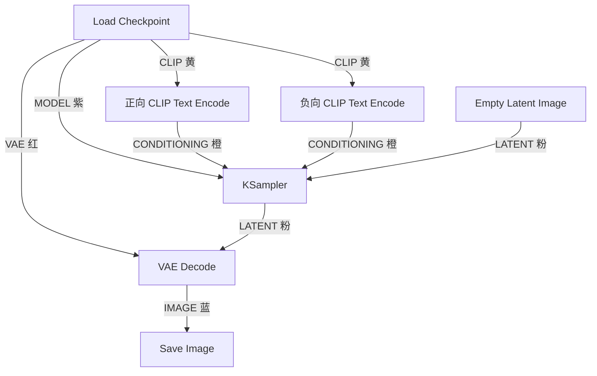

# 连线（Link）与数据类型

连线是把节点串成工作流的「传送带」，每条传送带只运一种货——**数据类型**。ComfyUI 用颜色区分类型：**颜色相同，才能相连**。这是连线的第一法则，也是排查错误的第一线索。

## 六种核心数据类型

| 颜色 | 类型 | 一句话解释 | 典型来源 → 去向 |
| ---- | ---- | ---------- | ---------------- |
| MODEL 紫 | 模型 | 去「生图」的那台发动机 | Checkpoint → KSampler |
| CLIP 黄 | 文本编码器 | 把文字翻译成向量语言的翻译官 | Checkpoint → CLIP Text Encode |
| CONDITIONING 橙 | 条件 | 翻译后的提示词向量，引导去噪方向 | CLIP Text Encode → KSampler |
| LATENT 粉 | 潜空间图像 | 压缩后的「像素世界的底片」 | Empty Latent / VAE Encode → KSampler |
| VAE 红 | 编解码器 | 潜空间与像素世界之间的翻译官 | Checkpoint → VAE Encode / Decode |
| IMAGE 蓝 | 像素图像 | 你最终看到的图片 | VAE Decode → Save Image |

> 💡 记忆法：两条「翻译官」线（黄 CLIP、红 VAE）都从 Checkpoint 出发——一个大模型内部本来就同时装着发动机（UNet）、文本翻译官（CLIP）和图像翻译官（VAE）三件套。

## 连线基本操作

| 操作 | 方式 |
| ---- | ---- |
| 建立连线 | 从**输出口**（右侧圆点）按下拖到目标**输入口**（左侧圆点） |
| 断开连线 | 把连线**末端拖到画布空白处**松开，或点击输入口圆点拔出 |
| 理线 | 加一个 Reroute（转折）节点，或右键菜单里转换节点为可折叠组 |
| 快速替换 | 把新连线直接拖到已占用的输入口，会自动替换旧连线 |

:::note 类型不匹配会怎样
把 IMAGE 线拖到 LATENT 口上，节点会拒绝连接（或连线变虚并报错），运行时控制台也会提示类型不匹配。**先看圆点颜色，再落线**，可以避开九成的连线错误。
:::

## 一个典型连线网

数一数：六种颜色各就各位。以后任何复杂工作流，你都可以按颜色把这张网拆成六条「单色线路」来读。

## 连线层面的常见故障排查

| 症状 | 最可能的原因 |
| ---- | ------------ |
| 运行报「required input is missing」 | 某个必填输入口没连线也没填值 |
| 图像一路正常但 Save Image 不出图 | VAE Decode 的 VAE 输入线松了（常见于换模型后） |
| 换了模型就报错 | 新 Checkpoint 缺少 VAE/CLIP 输出（如部分分层模型需单独加载 VAE） |
| 线很多很乱看不懂 | 从输出节点倒着梳理，给每条线标颜色归属 |

:::tip
把鼠标悬停在圆点或连线上，工具提示会显示完整的类型名。拿不准时，悬停一下胜过猜十次。
:::
