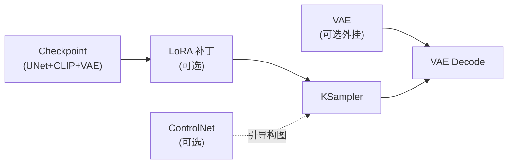

# 模型（Models）

工作流是骨架，模型是血肉。同一套节点，换上不同模型，产出的画风与能力完全不同。本页帮你建立「模型地图」：每类模型是什么、放哪里、在流水线中扮演什么角色。

## 大模型（Checkpoint）

Checkpoint（检查点）是最「重」的模型文件，动辄数 GB。它是一个**三件套打包**：

| 内含组件 | 全称 | 职责 | 在工作流中 |
| -------- | ---- | ---- | ---------- |
| UNet（DiT） | 去噪网络 | 预测并去除噪声，真正「画图」的发动机 | MODEL 输出 → KSampler |
| CLIP / T5 | 文本编码器 | 把提示词翻译成模型语言 | CLIP 输出 → CLIP Text Encode |
| VAE | 变分自编码器 | 潜空间 ⇆ 像素空间的编解码 | VAE 输出 → VAE Encode / Decode |

常见架构 familiy：

- **SD 1.5**：512×512 分辨率起步，轻量、生态老而全；
- **SDXL**：1024×1024 起步，画质与构图更强；
- **Flux / SD3 系列**：新一代架构，文本理解更强，多配 T5/Gemma 文本编码器；
- **其他**：Pony、Illustrious 等分支，各有社区生态。

:::note 放置位置
Checkpoint 统一放在 `models/checkpoints/`；桌面版放在设置里指定的模型目录对应子文件夹。放错目录节点里就找不到它。
:::

## 其他常见模型类型

| 类型 | 文件大小 | 作用 | 典型用法 |
| ---- | -------- | ---- | -------- |
| **LoRA** | 几十~几百 MB | 对大模型的「补丁」，注入角色 / 画风 / 概念 | LoraLoader 串在模型线上，强度可调 |
| **VAE** | 约 300 MB | 单独的编解码器，修复偏灰偏暗的出图 | 接到 VAE Decode；部分模型需自带 |
| **ControlNet** | 1~5 GB | 用线条稿、深度图、姿态等控制构图 | 与 ControlNetApply 节点配合 |
| **Upscaler** | 几十 MB~GB | 超分辨率放大模型 | Upscale Image (using Model) 节点 |
| **Embedding / Textual Inversion** | 几 KB~百 KB | 一个「新词」打包成向量 | 直接写进提示词触发 |
| **视频 / 音频模型** | 不等 | Wan、LTX 等视频模型，音频模型 | 视频类工作流 |

## 从哪下载

- **Civitai**、**Hugging Face**：模型资源最集中的两大平台，下载页通常标注了所属架构（SD1.5 / SDXL / Flux…）与推荐用法；
- **Comfy 官方示例页**：提供各架构的示例工作流 JSON，可与之配套下载。
- 下载时留意 **架构匹配**：SDXL 的 Checkpoint 配 SDXL 的 LoRA 与 ControlNet，跨架构混用是新手最常见的「不出效果」原因。

## 一张图记住模型在流水线的位置

:::tip
不必一上来就囤几十个模型。**一个 Checkpoint + 一个 LoRA + 官方默认工作流**，足够完成本站全部基础拆解练习；等你明确自己想画什么风格，再按需扩充模型库。
:::
