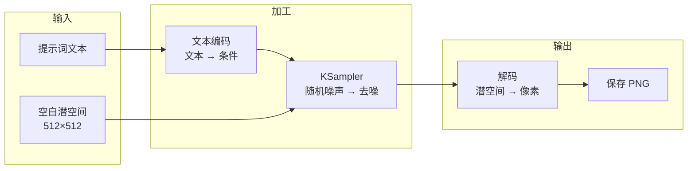

# 工作流：节点、链接与可视化编程

## 「工作流」到底是什么

**工作流（Workflow）** 就是一张用节点和连线搭出来的**数据处理流程图**。每生成一张图，数据都会沿着连线从起点流到终点，途中被各个节点依次加工。

你可以把它想象成一条食物生产线：

- **节点** = 加工车间（洗菜、切配、烹制、装盘）；
- **连线** = 传送带（半成品从上一站流向下一站）；
- **参数** = 每个车间的工艺开关（火候、时长）。

传统 GUI 工具把整条产线焊死在黑盒里，只留一个「开始」按钮；ComfyUI 则把产线整个摊开，你既可以只按按钮，也可以拆掉任何一站、加进任何一站。

## 一个最小工作流的解剖

以官方默认文生图工作流为例，数据经历四个加工阶段：

理解三个关键点，你就理解了所有工作流：

1. **数据沿连线单向流动**：一个节点的输出口连到另一个节点的输入口，上游不跑完、下游不开始；
2. **类型对得上才能相连**：连线有颜色，颜色代表数据类型（图像、潜空间、模型、条件……），同色互通；
3. **节点之间是解耦的**：只要输入输出类型匹配，任何节点都可以替换、插入、删除——这正是「拼积木」式创作的由来。

## 为什么官方选择节点式

| 优势 | 具体体现 |
| ---- | -------- |
| 过程透明 | 每一步的输入输出都能单独查看、单独调试 |
| 结果可复现 | 工作流可存为 JSON，甚至直接写进生成图的 PNG 元数据里——把图拖回画布即可还原整条产线 |
| 灵活组合 | 文生图、图生图、重绘、放大……本质是同一套节点的不同拼法 |
| 社区共享 | 别人的工作流文件一键加载，学习成本从「读代码」降到「看图连线」 |

## 三个操作建议

- **先读后建**：拿到任何复杂工作流，先从「最终输出节点」倒着往回看，找到它的直接上游，再逐层展开；
- **小步验证**：每改一处就连跑一次（`Ctrl + Enter`），确认数据仍能流到终点，不要一次改十个地方；
- **随手保存**：`Ctrl + S` 导出 JSON，命名规范一点（如 `t2i-euler-30steps.json`），它们是你未来的素材库。

:::note 与本站拆解系列的呼应
「总—分—总」拆解中的「总」，读的正是工作流这层骨架：先看数据从哪来、经过哪些加工、到哪去，再进入「分」的逐节点细读。
:::
