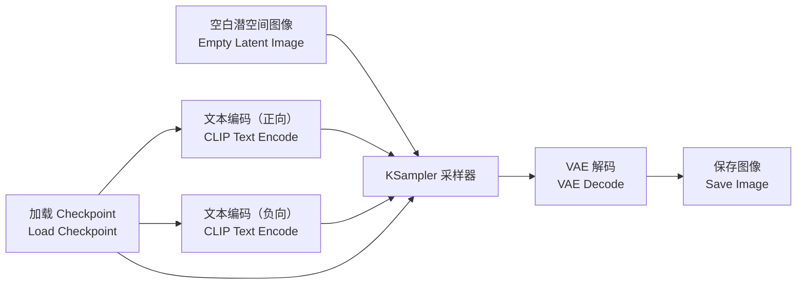

# 首次生成图像

装好 ComfyUI 后，打开界面你会看到画布上已经摆好一条现成的流水线——这就是官方默认工作流，也是后续所有拆解的主角。这一篇不深挖原理（那是[文生图深度拆解](/docs/tutorials/t2i)的任务），只带你把第一张图跑出来。

## 默认工作流长什么样

六个节点、三条线：模型线、文本条件线、图像线。看不懂没关系，先跑起来。

## 三步跑出第一张图

### 第 1 步：写提示词

找到两个 **CLIP Text Encode (Prompt)** 节点：

- 连向 **positive（正向）** 端的：写下你**想要**的内容，例如
  `beautiful scenery, nature, glass bottle landscape, purple galaxy bottle`
- 连向 **negative（负向）** 端的：写下你**不想要**的内容，默认给了 `text, watermark`（文字和水印），可以先不动。

### 第 2 步：点击队列

点击界面上的 **Queue Prompt / 运行** 按钮（或按 `Ctrl + Enter`）：

- 第一次运行会经历「加载模型 → 编码 → 采样 20 步 → 解码」的过程，视显卡性能从几秒到一两分钟不等；
- 采样过程中 KSampler 节点会有一圈进度高亮，右侧队列面板能看到排队与执行状态。

### 第 3 步：看图、存图、换种子

- 生成完成后，**Save Image** 节点会显示结果缩略图；
- 图像同时保存在输出目录（默认文件名前缀为 `ComfyUI_` 加编号）；
- 想再抽一张卡：把 KSampler 的 **seed（随机种子）** 的控制方式切为 `randomize`（随机），再点一次队列，同参数下也会得到不同的图。

## 跑通之后，试着改三个东西

| 改哪里 | 效果 |
| ------ | ---- |
| 正向提示词换成一整句中文或英文场景描述 | 观察画面内容如何随文本变化 |
| Empty Latent Image 的宽高改成 `768 × 768` | 分辨率变大，显存占用上升 |
| KSampler 的 steps 从 `20` 改成 `30` | 采样步数更多，细节通常更充分、耗时更长 |

:::tip 迷路了就回到默认
工作流改乱了，随时通过菜单 **Workflow → Browse Templates / 加载默认** 恢复官方模板。保存自己满意的版本时用 `Ctrl + S` 导出 JSON 文件。
:::

准备好了就进入[文生图工作流深度拆解](/docs/tutorials/t2i)，把这六个节点一个一个吃透。
