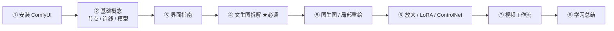

# 介绍：如何使用本站

## 什么是 ComfyUI？

ComfyUI 是一款开源的、**基于节点（Node-based）** 的生成式 AI 图形界面。它把「生成一张图 / 一段视频」这件事拆解成一个个功能节点——加载模型、编码文本、采样去噪、解码保存——再用连线把它们串成一条完整流水线，这条流水线就叫**工作流（Workflow）**。

与「输入提示词、点一下按钮」的黑盒式工具相比，ComfyUI 把每一个中间环节都摊开在你眼前：

- **看得见**：提示词如何变成条件、潜空间长什么样、模型在哪一步介入，全部可视化；
- **改得动**：想换模型、加 LoRA、上 ControlNet，插一个节点连两根线就行；
- **可复现**：整个工作流可以保存为 JSON 文件，别人拿到文件就能 1:1 还原你的结果；
- **能扩展**：社区数以千计的自定义节点可以随时加装进流水线。

## 本站的教学法：总 — 分 — 总

本站的**官方工作流拆解**系列，每篇都遵循同一个三段式结构，目的是让你「先见森林，再见树木，最后带走森林」：

| 阶段 | 回答的问题 | 在本篇中的形态 |
| ---- | ---------- | ---------------- |
| 🎯 **总**（总览） | 这个工作流整体在做什么？数据从哪来、到哪去？ | 流程图 + 节点清单 + 数据主线 |
| 🔍 **分**（拆解） | 每个节点具体做什么？参数怎么调？为什么这么连？ | 逐节点的输入/输出/参数详解 + 原理 |
| ✅ **总**（总结） | 学完后如何验证自己会了？下一步学什么？ | 检查清单 + 常见问题 + 练习 + 进阶指引 |

## 学习路线图

建议按以下顺序学习，前两步是地基，第三步开始进入拆解系列：

## 阅读约定

- 文中用彩色小徽标注明连线的**数据类型**：MODEL CLIP CONDITIONING LATENT VAE IMAGE，与画布上的连线颜色一一对应（详见[连线与数据类型](/docs/concepts/connections)）；
- 涉及界面操作的按键以 `Ctrl + Enter` 这种格式书写；
- 各篇教程的节点说明以 ComfyUI 内置节点为准；ComfyUI 更新较快，若个别名称或默认值有出入，请以你手上的版本与[官方文档](https://docs.comfy.org/zh)为准。

:::tip 学习心态
节点式工具的上手门槛在「第一次看懂一张图」，而不是「记住每个参数」。把[文生图拆解](/docs/tutorials/t2i)那一篇逐字读完、照着连一遍线，后面的所有工作流都只是它的变奏。
:::
