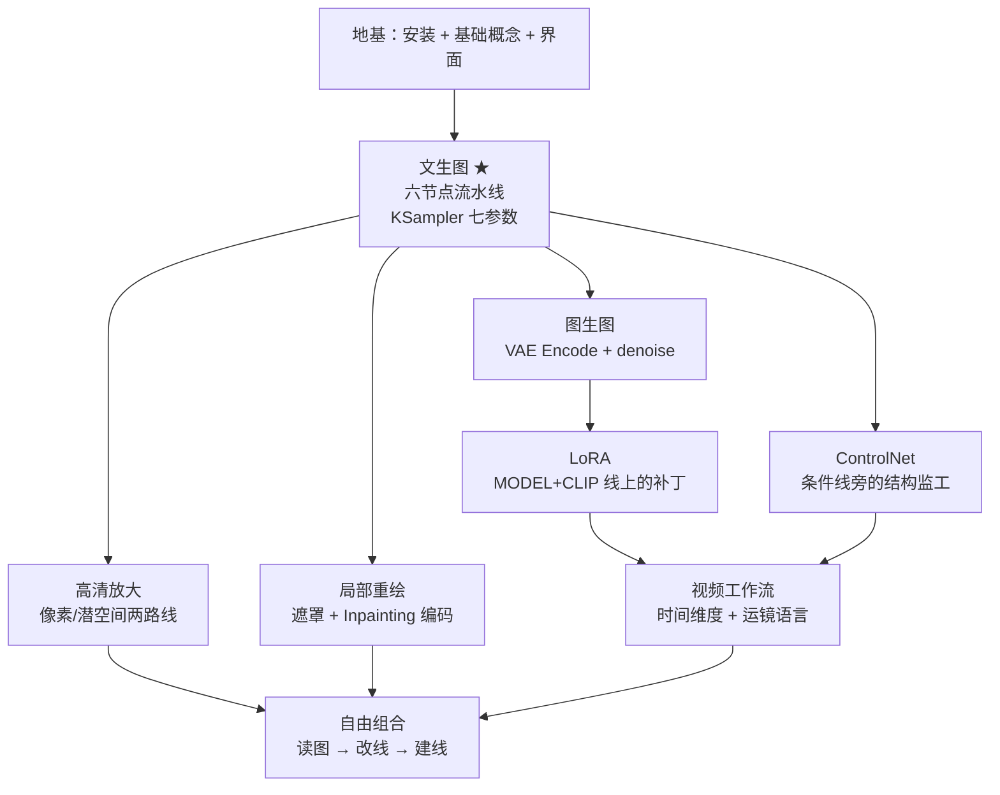

# 总结：学习路线与进阶

这是全站的收尾——把每一篇教程收拢成一张地图。读完这篇，你应该能自信地说：给我任何一张 ComfyUI 工作流截图，我都能顺着连线讲出它在做什么。

## 🗺️ 全站学习地图

## 一张表带走核心认知

| 主题 | 一句话内核 | 详见 |
| ---- | ---------- | ---- |
| 工作流 | 数据沿连线单向流动，节点是加工车间 | [工作流](/docs/concepts/workflow) |
| 连线 | 颜色即类型，同色才能相连 | [连线](/docs/concepts/links) |
| Checkpoint | 发动机 UNet + 翻译官 CLIP + 冲洗工 VAE 三件套 | [模型](/docs/concepts/models) |
| 文生图 | 文本 + 噪声底片 → 去噪 → 解码 | [文生图](/docs/tutorials/basic/text-to-image) |
| 图生图 | denoise 是「保留度」的反向旋钮 | [图生图](/docs/tutorials/basic/image-to-image) |
| 重绘 | 遮罩圈地，锚住圈外像素 | [局部重绘](/docs/tutorials/basic/inpaint) |
| 放大 | 小图生成、二次放大补细节 | [图像放大](/docs/tutorials/basic/upscale) |
| LoRA | 插在 MODEL+CLIP 线上的低秩补丁 | [LoRA](/docs/tutorials/basic/lora) |
| ControlNet | 在条件线上旁路监工结构 | [ControlNet](/docs/tutorials/controlnet/overview) |
| 视频 | 底片变帧堆，提示词加运镜 | [Wan2.2 视频](/docs/tutorials/video/wan2_2) |

## 参数速查卡（截图保存）

| 参数 | 常用范围 | 说明 |
| ---- | -------- | ---- |
| steps | 20 ~ 30 | 太少糊，太多浪费 |
| cfg | 6 ~ 8 | 过低不听话，过高烧画面（视频模型另说） |
| denoise | 文生图 1.0 / 图生图 0.4~0.7 / 精修 0.3~0.5 / 重绘 0.6~1.0 | 保留度反向旋钮 |
| 分辨率 | SD1.5≥512 / SDXL≥1024，8 的倍数 | 小图生成 + 放大是正道 |
| LoRA 强度 | 0.7 ~ 1.0 | 双旋钮（model / clip） |
| ControlNet strength | 0.6 ~ 1.0 | end_percent 0.6~0.8 收手 |

## 排错思维树

遇到任何故障，按这个顺序问：

1. **报错点名了哪个节点？** → 从它开始查（缺输入？类型不匹配？显存？）
2. **哪条颜色的线断了/悬空？** → 六色线路逐条走查
3. **结果不对但没报错** → 回到参数：seed 是否被 randomize 了？cfg / denoise 是否越界？模型与外挂（LoRA/ControlNet/VAE）是否同架构同源？
4. **一切可疑** → 加载官方模板原样跑一遍，确认环境无恙后，二分法逐段替换自己的改动。

## 进阶路线

- **效率**：批处理队列、Primitive 节点统一管理参数、子流程（Subgraph）封装常用模块；
- **生态**：Manager 安装社区节点包（放大算法、分割抠图、批量遮罩……），装完按 `R` 刷新；
- **云端**：了解 Comfy 官方云与 API 节点，把工作流交付给无卡设备调用；
- **原理**：读懂扩散模型的去噪本质（[文生图教程](/docs/tutorials/basic/text-to-image)中对扩散模型的讲解是入口），再回头理解采样器差异，你会比 90% 的使用者更「知其所以然」；
- **保持更新**：ComfyUI 迭代很快，以[官方文档](https://docs.comfy.org/zh)与[官方示例库](https://comfyanonymous.github.io/ComfyUI_examples/)为第一信息源。

## 结语

回到本站的承诺：「让每位爱好者都能学会 ComfyUI」。学会的标志不是背下参数，而是获得一种**读图能力**——看到任何陌生工作流，都能从输出端倒推到输入端，讲清每条彩色线路的来龙去脉。

现在，打开 ComfyUI，把这一路拆过的工作流重新拼一遍吧。祝你出图顺利 🎨
