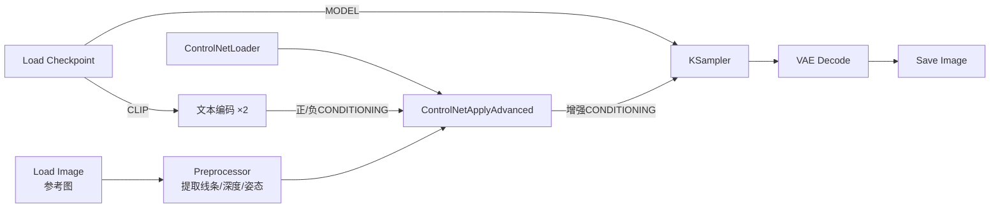

# ControlNet 工作流拆解：总 — 分 — 总

提示词能描述内容，却很难描述**构图**——「人物站在左边、举起右手」写十遍也未必听话。ControlNet 的解决方案：给模型一张**参考图**（线条稿、深度图、姿态图……），让生成结果严格遵循它的空间结构。

## 🎯 总：给去噪过程加一位「结构监工」

一句话：

> **ControlNet 模型旁路监听去噪的每一步，不断提醒模型「结构要像我给的参考图」。**

信息流上它比 LoRA 多绕一路：**参考图 → 预处理 → 注入正/负两条条件线**，最终仍汇入 KSampler。

## 🔍 分：三个节点、一个旋钮

### ① ControlNetLoader：选择「监工」的专业方向

| 项目 | 内容 |
| ---- | ---- |
| 输入 | 无（从 `models/controlnet` 选择） |
| 输出 | CONTROL_NET |

ControlNet 按控制维度分家，常用的有：**Canny / Lineart**（线稿）、**Depth**（景深结构）、**OpenPose**（人体姿态）、**MLSD**（建筑直线）等。选型原则：**想控制什么，就加载对应的 ControlNet**，且架构需与 Checkpoint 一致（SD1.5 / SDXL 各有版本）。

### ② 预处理器：把照片变成「结构图」

参考图不必是你手绘的线稿——社区预处理器（来自 ControlNetAux 等节点包）可以从普通照片自动提取：

| 想控制 | 预处理器 | 提取出的结构图 |
| ------ | -------- | ---------------- |
| 轮廓与细节 | Canny / Lineart | 黑底白线的轮廓稿 |
| 空间布局 | Depth Anything 等 | 近亮远暗的深度图 |
| 人物动作 | OpenPose | 火柴人骨架图 |

**原理**：ControlNet 训练时吃的就是这种「结构图」，预处理器负责把真实照片翻译成它的母语。你也可以跳过预处理，直接把**自己画的线稿**连进 Apply 节点——这正是「草稿变成品」玩法的入口。

### ③ ControlNetApplyAdvanced：注入点

| 项目 | 内容 |
| ---- | ---- |
| 输入 | 正 / 负 CONDITIONING ＋ IMAGE（结构图）＋ CONTROL_NET |
| 参数 | `strength`（控制力度）、`start_percent` / `end_percent`（生效区间） |
| 输出 | 增强后的正 / 负 CONDITIONING（接回 KSampler） |

| 参数 | 建议 | 说明 |
| ---- | ---- | ---- |
| `strength` | 0.6 ~ 1.0 | 越高结构越死板，越低越自由；描图场景可到 1.0 |
| `start_percent` | 0 | 从第几比例开始监工 |
| `end_percent` | 0.6 ~ 0.8 | 后期放手让模型自由补细节，画面更自然 |

> ✅ 正负两条条件线**都要**经过 Apply 节点再进 KSampler（Advanced 版一次处理两路）；漏掉负向一侧是「结构控制时灵时不灵」的常见原因。

## ✅ 总：总结与练习

### 学会了什么

1. ControlNet 是「条件线上的旁路监工」，不直接碰模型与底片；
2. 三件套分工：Loader 选方向、Preprocessor 做翻译、Apply 定力度；
3. `strength` 控死板程度，`end_percent` 控何时放手；
4. 手绘线稿可以直接当参考图——草稿变成品的通路。

### 常见问题

| 现象 | 原因 |
| ---- | ---- |
| 结构完全没跟上 | 忘了预处理 / ControlNet 架构与模型不匹配 / strength 太低 |
| 画面死板像描图 | strength 过高或 end_percent 拉到 1.0 |
| 只剩构图没了内容 | 提示词太空；结构监工不负责内容，内容仍靠提示词 |
| 效果时好时坏 | 负向条件线没经过 Apply 节点 |

### 动手练习

1. 找一张人物照片 → OpenPose 预处理 → 生成一个「同一动作、完全不同角色与画风」的新画面；
2. 用画图软件手绘一个简单构图（大色块即可），走 Canny ControlNet 生成成品；
3. 固定 seed，把 strength 从 0.4 拉到 1.0，观察「自由度 ↔ 服从度」的滑杆效应。

### 下一步

至此静态图像的四板斧（文生图 / 图生图 / 重绘 / 放大）加两大外挂（LoRA / ControlNet）齐了。最后的篇章：让画面动起来 → [视频生成工作流](/docs/tutorials/video)。
