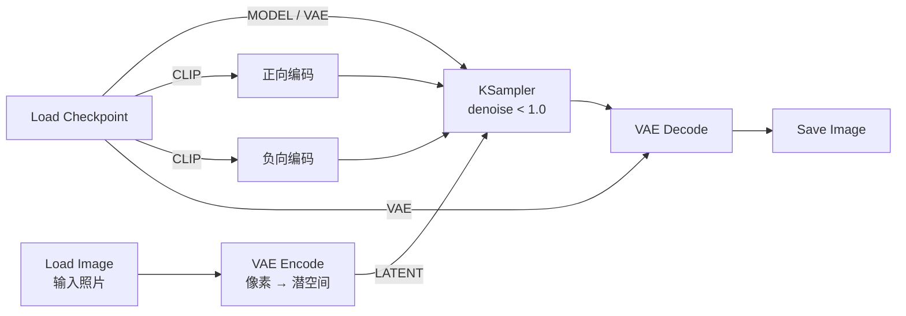

# 图生图工作流拆解：总 — 分 — 总

图生图（Image to Image）是文生图的第一个「变奏」：**输入从文字变成了照片**。它只改动文生图流水线的一处，却打开了风格迁移、概念融合等一大批玩法。

## 🎯 总：和文生图差在哪？

一句话：

> **把「空白噪声底片」换成「真实照片编码成的带信息底片」，再让采样器只洗掉一部分噪声。**

对照文生图，变化只有两处：

| 位置 | 文生图 | 图生图 |
| ---- | ------ | ------ |
| 底片来源 | Empty Latent Image（纯噪声） | Load Image → VAE Encode（照片编码） |
| denoise | 1.0（全部重画） | 0.3 ~ 0.8（部分重画） |

其余节点完全复用——这就是「积木」的好处。

## 🔍 分：两个新节点 + 一个关键参数

### ① Load Image：把照片装进来

| 项目 | 内容 |
| ---- | ---- |
| 输入 | 无（从上传目录选择，也可直接把图片拖进画布自动创建） |
| 参数 | `image`：文件下拉框 |
| 输出 | IMAGE ＋ MASK（遮罩通道，重绘篇会用到） |

> ✅ 照片会先被缩放到工作流设定的处理尺寸，超大图不必担心。

### ② VAE Encode：照片「冲洗」回底片

| 项目 | 内容 |
| ---- | ---- |
| 输入 | IMAGE ＋ VAE |
| 输出 | LATENT |

**原理**：VAE 编码是解码的逆过程——把像素压缩回潜空间。得到的「底片」已经携带了照片的构图与内容信息，所以采样器不需要从零开始画。

> ✅ VAE 必须与当前 Checkpoint 配套；换模型后记得同步换 VAE 线的来源。

### ③ KSampler 的 denoise：本篇唯一的灵魂参数

`denoise` 表示「洗掉多大比例的噪声」——数值越大，改写越彻底：

| denoise | 效果 | 适用场景 |
| ------- | ---- | -------- |
| 0.2 ~ 0.4 | 轻描淡写，构图与细节几乎保留 | 微调画质、轻微换风格 |
| 0.4 ~ 0.6 | 保留主体结构，画面细节与风格明显重绘 | 风格迁移（最常用区间） |
| 0.6 ~ 0.8 | 只保留大致布局，内容大幅重写 | 概念变体、找灵感 |
| 1.0 | 完全重画（等价于文生图） | — |

> ✅ 经验法则：**想留多少原图，就往小了调；想变多少，就往大了调。** 步数较少时（如 15~20），denoise 会按比例折算成更少的实际去噪步数，出图也更快。

## ✅ 总：总结与练习

### 学会了什么

1. 图生图 = 文生图 − Empty Latent ＋ Load Image → VAE Encode；
2. `denoise` 是「保留度」的反向旋钮；
3. VAE Encode / Decode 是一对可逆的「像素 ⇆ 底片」转换器；
4. 换模型时，编码与解码的 VAE 必须同源。

### 常见问题

| 现象 | 原因 |
| ---- | ---- |
| 结果和原图毫无关系 | denoise 太高；或照片线没接进 KSampler |
| 结果几乎没变化 | denoise 太低，提到 0.5 试试 |
| 出图发灰 | VAE 不配套 |
| 分辨率怪异 | 原图尺寸不是 8 的倍数，先裁剪或缩放 |

### 动手练习

1. 同一张图、同参数，denoise 取 0.3 / 0.5 / 0.7 各跑一次，排成一列对比；
2. 用一句与原图内容**完全不同**的正向提示词 + denoise 0.6，看看「结构保留、内容重写」的效果；
3. 思考题：为什么 denoise=1 时，Load Image 这条线就「白连」了？

### 下一步

只想改画面的一小块，而不是整体洗牌？→ [局部重绘拆解](/docs/tutorials/inpaint)。
