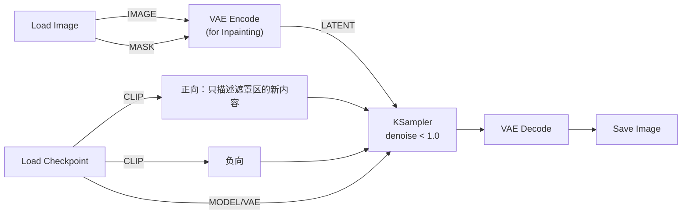

# 局部重绘工作流拆解：总 — 分 — 总

局部重绘（Inpaint）解决一个精确的问题：**画面里 95% 都满意，只想改其中一小块**。它的思路是给图生图加一张「遮罩」：遮住的区域重画，其余区域原样保留。

## 🎯 总：遮罩 + 部分去噪

一句话：

> **用遮罩告诉采样器「只在这里动手」，遮罩内按图生图的方式部分去噪，遮罩外原封不动。**

与图生图相比，依旧是「只加不改」：底片从「整张照片编码」换成「照片 + 遮罩编码」。

## 🔍 分：三个关键点

### ① 制作遮罩：在 Load Image 上直接画

新版 ComfyUI 把遮罩工具内置进了 Load Image 节点：**鼠标悬停在节点缩略图上，点击 Open in MaskEditor（在遮罩编辑器中打开）**，用画笔涂出想重绘的区域，保存即可。遮罩会随 MASK 输出口流向下游。

> ✅ 遮罩编辑器里画笔是「可撤销」的，涂出界可以擦除；范围宁小勿大——重绘区越大，与周围融合的难度越高。

### ② VAE Encode (for Inpainting)：专为重绘准备的编码器

| 项目 | 内容 |
| ---- | ---- |
| 输入 | IMAGE ＋ VAE ＋ MASK |
| 输出 | LATENT（已携带遮罩信息） |

**原理**：普通 VAE Encode 只编码像素；Inpainting 版本把遮罩一并编码进潜空间，让采样器知道哪些位置允许变化。它是官方模板的标准做法，替代了早期「手动 Expand Mask / Set Latent Noise Mask」的多节点写法。

> ✅ 找不到这个节点？双击画布搜索 `Inpainting`。

### ③ 提示词与 denoise 的配合

重绘的提示词只需描述**遮罩区域里想要什么**，不必复述整张图：

| 要素 | 建议 |
| ---- | ---- |
| 正向 | 遮罩区的新内容，如 `a red ceramic mug on the table` |
| 负向 | 常规负面词即可 |
| denoise | 0.6 ~ 1.0：区域小、要求融合时不必怕高值，因为外部像素是「锚」 |
| 尺寸 | 保持与原图一致，不要动 Empty Latent（本流程里根本没有它） |

**融合不顺？** 两个技巧：把遮罩边缘扩一点（编辑器里有 Expand 选项），让过渡带有重来重画的空间；或把 denoise 降到 0.7 让新内容更「迁就」周边光影。

## ✅ 总：总结与练习

### 学会了什么

1. MaskEditor 画遮罩 → MASK 输出口 → Inpainting 编码器，是重绘的三步链；
2. 重绘提示词只写遮罩区的内容；
3. 遮罩外像素是「锚」，所以重绘的 denoise 可以比图生图更大胆；
4. 遮罩边缘的 Expand 余量决定融合的自然度。

### 常见问题

| 现象 | 原因 |
| ---- | ---- |
| 遮罩外也被改了 | 遮罩没接进编码器（用了普通 VAE Encode） |
| 重绘区边缘有「补丁感」 | 遮罩太贴边，扩大遮罩或降低 denoise |
| 重绘区内容与环境不搭 | 提示词里补充环境相关词汇（光线、材质） |

### 动手练习

1. 给一张照片里的人物换一件衣服的颜色（遮罩只盖衣服）；
2. 抹除练习：正向提示词只写环境词（如 `wooden floor`），把遮罩区的杂物「涂掉」；
3. 思考题：为什么重绘时 denoise=1 也不会「整张图重来」？锚在哪里？

### 下一步

重绘是「修」，放大是「精」→ [高清放大拆解](/docs/tutorials/upscale)。
