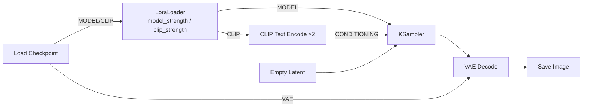

# LoRA 工作流拆解：总 — 分 — 总

LoRA（Low-Rank Adaptation）是大模型的「外挂补丁」：单个文件通常只有几十到几百 MB，却能教会模型一个特定角色、一种画风或一个概念。在 ComfyUI 里使用它，只需要**在模型线上插一个节点**。

## 🎯 总：插在发动机进油管上的调和阀

一句话：

> **LoRA 读取大模型，输出「大模型 + 补丁」的增强版，替换进原来的 MODEL 与 CLIP 线。**

与文生图相比，唯一变化：Load Checkpoint 不再直接连 KSampler 和文本编码器，而是**先经过 LoraLoader**。其余一切照旧。

## 🔍 分：一个节点、四个参数、一条触发词

### ① LoraLoader 的接线

| 项目 | 内容 |
| ---- | ---- |
| 输入 | MODEL ＋ CLIP（都来自 Checkpoint） |
| 参数 | `lora_name` 选择文件；`strength_model`、`strength_clip`；`lora_1` 可继续串下一个 LoRA |
| 输出 | 增强后的 MODEL ＋ CLIP |

**关键理解**：LoRA 同时影响两条线——`MODEL` 线改变「怎么画」，`CLIP` 线改变「怎么理解提示词」。所以它有**两个**强度参数；下游的 CLIP Text Encode 必须接 LoRA 之后的 CLIP，否则触发词可能失灵。

### ② 两个强度旋钮

| 参数 | 起步建议 | 说明 |
| ---- | -------- | ---- |
| `strength_model` | 0.8 ~ 1.0 | 补丁对画面的影响力度；过高易「糊脸」「乱细节」，过低无感 |
| `strength_clip` | 0.8 ~ 1.0 | 补丁对文本理解的影响；没有专属触发词的画风 LoRA 也可适当调低 |

两处都支持 0 到 1.5 的连续调节——**效果不满意先动旋钮，再想换文件**。

### ③ 触发词：补丁的钥匙

多数角色 / 概念 LoRA 需要**触发词（trigger word）**：把特定词写进正向提示词，补丁才会被唤醒（如作者 README 里标注的 `mycharname`）。画风 LoRA 则往往不设触发词、全时生效。

> ✅ 每个 LoRA 的发布页都会写明推荐触发词、基础架构（SD1.5 / SDXL…）与推荐强度，下载时记三样：**架构匹配、触发词、推荐强度**。

### ④ 串联多个 LoRA

LoraLoader 的输出可以接进下一个 LoraLoader 的输入，像串糖葫芦一样叠加「角色 LoRA + 画风 LoRA」。经验：总强度会互相稀释与冲突，一次加 2~3 个为宜，从 0.7 左右的强度起步微调。

## ✅ 总：总结与练习

### 学会了什么

1. LoRA 是插在 MODEL+CLIP 两条线上的「调和阀」；
2. 双强度旋钮各自的含义与调节顺序；
3. 触发词要写进**正向**提示词，且文本编码必须接 LoRA 之后的 CLIP；
4. 多 LoRA 可串联，但要克制。

### 常见问题

| 现象 | 原因 |
| ---- | ---- |
| 加了完全没效果 | 强度为 0 / 触发词没写 / CLIP 接的是 LoRA 之前的输出口 |
| 人物脸崩、画面脏 | 强度过高，降回 0.8 以下 |
| 画风对但主体不像 | 只改了 MODEL 强度，`strength_clip` 太低 |
| 报架构不匹配错误 | SDXL 模型配了 SD1.5 的 LoRA（反之亦然），必须同架构 |

### 动手练习

1. 装一个画风 LoRA，strength_model 从 0.6 拉到 1.2，固定 seed 对比画风变化曲线；
2. 串两个 LoRA（角色+画风），试着只写角色触发词，观察画风是否同样生效；
3. 思考题：为什么 LoRA 只有几百 MB 就能改变模型行为？（提示：它存的是「变化量」，不是整个模型。）

### 下一步

LoRA 改变「画什么」，ControlNet 决定「怎么构图」→ [ControlNet 拆解](/docs/tutorials/controlnet)。
