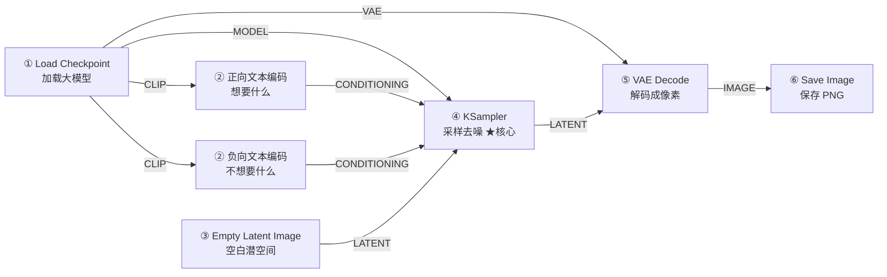

# 文生图工作流深度拆解：总 — 分 — 总

这是官方教程中最基础、也最重要的一条工作流。本篇按「总 — 分 — 总」展开：先俯瞰全貌，再逐个节点精读，最后收拢成一张你带得走的知识地图。**读完并照做一遍，你就掌握了 ComfyUI 的一半。**

---

## 🎯 总：一张图是怎么诞生的？

### 一句话概括

> **文本和一块空白潜空间进入采样器，在模型的驱动下被逐步去噪，最后解码成像素图片。**

### 六节点流水线



### 节点清单与分工

| # | 节点 | 一句话职责 | 主要输入 | 主要输出 |
| - | ---- | ---------- | -------- | -------- |
| ① | Load Checkpoint | 把大模型三件套装进流水线 | — | <span class="node-type model">MODEL</span> <span class="node-type clip">CLIP</span> <span class="node-type vae">VAE</span> |
| ② | CLIP Text Encode ×2 | 把正/负提示词翻译成条件向量 | <span class="node-type clip">CLIP</span> | <span class="node-type cond">CONDITIONING</span> |
| ③ | Empty Latent Image | 造一块指定尺寸的空白「底片」 | — | <span class="node-type latent">LATENT</span> |
| ④ | KSampler | 驱动模型逐步去噪，真正的画图引擎 | 全部汇入 | <span class="node-type latent">LATENT</span> |
| ⑤ | VAE Decode | 把潜空间底片冲洗成像素照片 | <span class="node-type latent">LATENT</span> <span class="node-type vae">VAE</span> | <span class="node-type image">IMAGE</span> |
| ⑥ | Save Image | 编码 PNG 并写入磁盘 | <span class="node-type image">IMAGE</span> | 文件 |

### 三条数据主线

读任何工作流都先找「主线」，这条流水线有三条：

1. **模型线（紫）**：Checkpoint → KSampler，提供发动机；
2. **条件线（橙）**：两段文本 → 编码 → KSampler，指明「画什么、避什么」；
3. **图像线（粉→蓝）**：空白潜空间 → KSampler 去噪 → 解码 → 保存，是「货」本身的流向。

KSampler 是三条线的**汇合点**——这也是为什么后续所有进阶玩法（LoRA、ControlNet、重绘……）最终都在它周围做文章。

---

## 🔍 分：逐节点精读

### ① Load Checkpoint：三件套一次性到齐

| 项目 | 内容 |
| ---- | ---- |
| 输入 | 无（从 `models/checkpoints` 目录选择文件） |
| 参数 | `checkpoint_name`：下拉选择模型文件 |
| 输出 | <span class="node-type model">MODEL</span> 发动机 ／ <span class="node-type clip">CLIP</span> 文本翻译官 ／ <span class="node-type vae">VAE</span> 图像翻译官 |

**原理**：一个标准 Checkpoint 内部打包了三个组件——UNet 去噪网络（真正画图的）、CLIP 文本编码器（翻译提示词的）、VAE（潜空间与像素互转的）。节点把三者拆成三个输出口，分别喂给流水线的不同环节。这也解释了一个高频故障：**换了模型就报错**，往往是因为新模型缺了某个组件（比如部分模型需要单独加载 VAE）。

> ✅ **新手要点**：三个输出口都要用上。少连任何一个，下游对应节点就会悬空报错。

### ② CLIP Text Encode：为什么要两个？

同一个节点在模板里出现两次，一次连到 KSampler 的 `positive`，一次连到 `negative`：

| 端 | 内容 | 作用 |
| -- | ---- | ---- |
| positive 正向 | 你**想要**的东西 | 把画面往这个方向拉 |
| negative 负向 | 你**不想要**的东西（如 `text, watermark`） | 把画面从这些方向推开 |

**原理**：节点调用 CLIP 模型把文字变成向量（数据类型变为橙色的 <span class="node-type cond">CONDITIONING</span>）。采样器在每一步去噪时同时参考两个方向——正向是「目标」，负向是「禁区」，两者夹击决定画面走向。

**提示词写法入门**：

- 英文为主、逗号分隔短语是最通用格式：`a cozy cabin in snowy forest, warm light, dusk`；
- 先「主体 + 场景 + 光线/氛围」，再按需加风格词；
- 想系统学习权重语法、进阶排版，见官方教程与社区提示词指南，本站不展开。

> ✅ **新手要点**：正负提示词必须是**同一个 CLIP 节点族**的输出（都从当前 Checkpoint 的 CLIP 口引出）。两个文本框之间没有任何连线——它们各自独立编码，在 KSampler 里才汇合。

### ③ Empty Latent Image：画布在「底片」上，不在像素里

| 项目 | 内容 |
| ---- | ---- |
| 输入 | 无 |
| 参数 | `width` / `height`：潜空间尺寸；`batch_size`：一次生成几张 |
| 输出 | <span class="node-type latent">LATENT</span> |

**原理**：扩散模型不在像素上作画，而在一个被压缩过的数学空间（潜空间，Latent Space）里工作。SD1.5 的潜空间边长是像素的 1/8，所以默认 `512×512` 对应的就是 512×512 的最终图片。这块「空白底片」初始是纯噪声，交给 KSampler 去洗。

**尺寸怎么选**（以目标像素为准，除以 8 得到潜空间尺寸，但节点里直接填**像素值**即可）：

| Checkpoint 架构 | 建议起步分辨率 | 越界的后果 |
| ---------------- | -------------- | ---------- |
| SD 1.5 | 512×512 | 超过 768 易出现重复肢体、构图崩坏 |
| SDXL | 1024×1024 | 低于 ~896 画质明显下降 |
| Flux / SD3 | 1024×1024 或其倍率 | 同上，且显存开销更大 |

`batch_size` 一次生成多张，显存按倍数消耗，小显存请保持 1。

> ✅ **新手要点**：分辨率尽量保持 8 的倍数（64 的倍数更佳）；「小图生成 → 后处理放大」永远比「直接生成大图」更省显存、更少翻车。

### ④ KSampler：全站最核心的节点

| 项目 | 内容 |
| ---- | ---- |
| 输入 | <span class="node-type model">MODEL</span> ＋ 正/负 <span class="node-type cond">CONDITIONING</span> ＋ <span class="node-type latent">LATENT</span> |
| 输出 | <span class="node-type latent">LATENT</span>（去噪完成的潜空间） |

七个参数，每个都值得认识一遍：

| 参数 | 默认 | 作用 | 调整心法 |
| ---- | ---- | ---- | -------- |
| `seed` | 随机 | 随机数种子，决定噪声的起点 | 同 seed + 同参数 = 同结果（可复现）；想抽卡就把控制切到 `randomize` |
| `control_after_generate` | randomize | 每次运行后 seed 如何变化 | 抽卡用 randomize；对比参数时切 `fixed`（固定） |
| `steps` | 20 | 去噪总步数 | 20~30 是常用区间；太少模糊，太多浪费且收益递减 |
| `cfg` | 8.0 | 提示词引导强度（Classifier-Free Guidance） | 越高越「听话」但易过饱和；7~8 万金油，过低无视提示词，过高画面烧焦 |
| `sampler_name` | euler | 采样算法 | `euler` / `euler_ancestral` 稳妥起步；`dpmpp_2m` 细腻高效；`*_ancestral` 系每步引入随机、更「有创造力」但不可完全复现 |
| `scheduler` | normal | 步数如何分配到每一步 | `karras` 通常让细节收尾更好，可与任意采样器搭配 |
| `denoise` | 1.0 | 降噪幅度 | 文生图恒为 1.0（从纯噪声开始）；小于 1.0 用于图生图/重绘（见后续拆解） |

**一次去噪在发生什么**：采样器让模型从满屏噪声出发，每一步参考正/负条件预测「噪声还剩多少」，扣掉一点，重复 `steps` 次。你可以把它理解成雕塑：噪声是大理石，条件是图纸，每一步凿掉一层。

> ✅ **新手要点**：先只动 `seed`（randomize 抽卡 / fixed 复现）和提示词；稳定后再探索采样器组合。参数调优没有玄学，一次只改一个变量。

### ⑤ VAE Decode：从底片到照片

| 项目 | 内容 |
| ---- | ---- |
| 输入 | <span class="node-type latent">LATENT</span>（来自 KSampler）＋ <span class="node-type vae">VAE</span>（来自 Checkpoint） |
| 输出 | <span class="node-type image">IMAGE</span> |

**原理**：VAE 解码器把潜空间的数学表示「冲洗」成 RGB 像素。它必须使用与模型配套的 VAE——出图发灰、发暗、色彩诡异，十有八九是 VAE 不配套或没接。有的架构需要从单独文件加载 VAE（用 Load VAE 节点替换这条输入线即可）。

### ⑥ Save Image：落盘与元数据

| 项目 | 内容 |
| ---- | ---- |
| 输入 | <span class="node-type image">IMAGE</span> |
| 参数 | `filename_prefix`：文件名前缀（默认 `ComfyUI`，自动追加编号） |

**原理与彩蛋**：保存的 PNG 内部写入了**完整工作流数据**。把生成的图直接拖回 ComfyUI 画布，整条流水线原样恢复——社区分享截图时这就是「信息量拉满」的方式。只想预览不想落盘时，用 Preview Image 替代即可。

---

## ✅ 总：收拢成你的知识地图

### 数据流一图回顾

```text
提示词(想要/不想要) ─CLIP→ 条件 ─┐
空白噪声 512×512 ────────────────┼─→ KSampler 去噪 20 步 ─→ VAE 解码 ─→ PNG
模型三件套 ─MODEL────────────────┘
```

### 学会了什么：十条检查清单

1. 能说出 Checkpoint 三件套（UNet / CLIP / VAE）各自去哪条线；
2. 能解释为什么要**两个** CLIP Text Encode；
3. 知道 LATENT 是「底片」、IMAGE 是「照片」，转换靠 VAE；
4. 知道六种连线颜色与「同色才能相连」；
5. 能背出 KSampler 七参数的名字与职责；
6. 知道 `seed` 如何复现与抽卡；
7. 知道 `cfg` 过高/过低分别会发生什么；
8. 知道自己所用架构的起步分辨率；
9. 会用 `Ctrl + Enter` 运行、`Ctrl + S` 保存、把图拖回画布还原工作流；
10. 能从报错信息定位到出问题的节点。

### 常见问题速查

| 现象 | 首选排查 |
| ---- | -------- |
| 提示 required input is missing | 找到悬空的输入口，补线或填值 |
| 画面与提示词无关 | cfg 太低 / 正负提示词接反了端口 |
| 画面过曝、色块化 | cfg 太高，降到 6~7 |
| 出图发灰发暗 | VAE 不配套，检查 VAE Decode 的 VAE 线 |
| 显存不足（OOM） | 降分辨率、batch_size=1、重启后单跑 |
| 四肢/构图崩坏 | 分辨率超出架构舒适区，或步数过少 |

### 动手练习

1. 把 `cfg` 从 8 依次改为 4、8、12（`seed` 固定），对比三张图，写下你的结论；
2. 把正向提示词换成一句完整的场景描述，负向加上 `blurry, lowres`，观察变化；
3. 新建一个 Preview Image 节点，接在 KSampler 之后，看看「没解码的底片」长什么样；
4. 用 `Ctrl + S` 保存你改好的工作流，再把它拖回画布验证可还原。

### 下一步

- 想以图改图 → [图生图拆解](/docs/tutorials/i2i)：把「空白底片」换成「照片编码」；
- 想控构图 → [ControlNet](/docs/tutorials/controlnet)；
- 想换画风 → [LoRA](/docs/tutorials/lora)。

> 📌 本篇节点说明基于 ComfyUI 内置节点整理；界面与默认值随版本更新可能微调，遇到出入请对照[官方文档](https://docs.comfy.org/zh/tutorials/basic/text-to-image)与你本机的节点提示。
