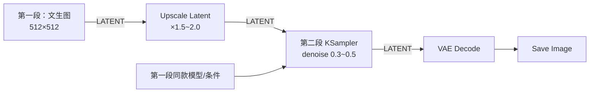

# 高清放大工作流拆解：总 — 分 — 总

模型有「舒适分辨率」：SD1.5 是 512、SDXL 是 1024，硬要直接生成 4K 会又慢又崩。**高清放大（Upscale）** 是标准解法：先在舒适区出图，再放大精修。

## 🎯 总：两条放大路线

一句话：

> **要么在像素世界用放大模型拉大图片，要么回到潜空间再采样一次补充细节。**

| 路线 | 发生在哪 | 核心节点 | 特点 |
| ---- | -------- | -------- | ---- |
| ① 像素放大 | 像素世界 | Upscale Image / Upscale Image (using Model) | 快、稳、构图不变；单纯放大不增细节 |
| ② 潜空间放大（高清修复） | 潜空间 | Upscale Latent + KSampler（denoise 中低） | 慢、能真正「补细节」；denoise 过高会改构图 |

官方教程的高清修复（Refine）思路，本质是路线②：**出小图 → 潜空间放大 → 低 denoise 精修**。

## 🔍 分：三个核心节点

### ① Upscale Image：像素世界的普通拉伸

| 项目 | 内容 |
| ---- | ---- |
| 输入 | IMAGE |
| 参数 | `upscale_method`（插值算法，默认 nearest-exact 即可）、`width` / `height`（可按比例或固定值） |
| 输出 | IMAGE |

相当于 PS 里的「图像大小」，胜在零成本、无失真风险，适合「够用就好」。

### ② Upscale Image (using Model)：超分放大模型

| 项目 | 内容 |
| ---- | ---- |
| 输入 | IMAGE ＋ UPSCALE_MODEL |
| 前置 | 需要 Load Upscale Model 节点加载 `models/upscale_models` 里的放大模型（如 4x 系列超分模型） |
| 输出 | IMAGE |

用训练好的超分网络放大，比插值锐利得多，是「纯放大」路线的推荐选择。放大倍率由模型自身决定（文件名里的 `4x` 即四倍）。

### ③ Upscale Latent + 二次采样：真正补细节

| 项目 | 内容 |
| ---- | ---- |
| Upscale Latent | LATENT 进，放大后的 LATENT 出；参数 `upscale_method` 与裁剪方式 |
| 配套 KSampler | 与第一段共用模型与条件，**denoise 设 0.3 ~ 0.5** |

**原理**：直接拉伸的底片「细节密度」并没有增加。把放大后的底片重新送进采样器、以低幅度去噪，模型会在更大的画布上重新脑补高频细节——这就是「精修」。

> ✅ denoise 红线：二次采样 **不要超过 0.55**，越高越接近重新生成，构图会漂移；只想加锐度停在 0.3 左右。

## ✅ 总：怎么选、怎么串

### 决策表

| 你的情况 | 推荐路线 |
| -------- | -------- |
| 显存紧张 / 求快 / 构图必须一字不改 | 路线①＋超分模型 |
| 想要真正的细节增强，愿多花时间 | 路线②（两段式高清修复） |
| 追求极致 | 两段式精修后再叠一层超分模型收尾 |

### 搭建两段式的三条提醒

1. **两段共用同一套 Checkpoint 与提示词**：第二段 KSampler 的 model / positive / negative 线从第一段的相同来源引出；
2. **第一段的小图别解码保存也可以**：潜空间直接流进 Upscale Latent，少一次编解码、少一点画质损耗；
3. **显存预算**：放大是平方代价，1.5× 已是显著提升；2× 的计算量是 4 倍，按需选择。

### 动手练习

1. 用当前文生图工作流出一张 512×512，接 Upscale Latent ×1.5 + KSampler（denoise 0.35）跑两段式；
2. 同一张图分别走「插值放大 2×」和「超分模型 2×」，放大局部对比发丝与纹理；
3. 把二次采样 denoise 调到 0.8，观察构图如何「背叛」原图——这就是红线的由来。

### 下一步

画面质量到位了，接下来给模型注入个性 → [LoRA 拆解](/docs/tutorials/lora)。
