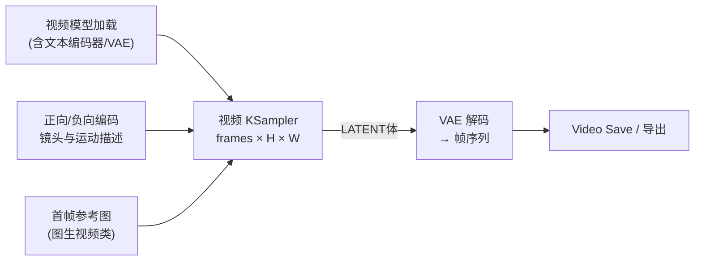

# 视频生成工作流拆解：总 — 分 — 总

视频模型（Wan、LTX 等系列）把扩散模型从「一张底片」推向「一叠连续帧」。好消息是：**骨架没变**——你在文生图里学到的一切依然成立；变化的是底片变成了带时间维度的「三维体」。

## 🎯 总：一叠帧 + 一个运动信息源

一句话：

> **把单张潜空间换成「帧数 × 高 × 宽」的潜空间体，用文本（或首帧图像）描述运动，采样器一次性去噪出整段视频。**



与图像工作流的三个对应关系：

| 图像工作流 | 视频工作流 | 变化 |
| ---------- | ---------- | ---- |
| Empty Latent（宽×高） | 空「视频体」（宽×高×帧数，常以 fps 参数指定帧率） | 多了时间维度 |
| CLIP 文本编码 | 专用文本编码器（各家族不同） | 描述从「内容」扩展到「镜头运动」 |
| VAE Decode 出一张图 | 解码出帧序列，再编码/保存为视频文件 | 输出端多一步封装 |

## 🔍 分：动手前必须想清的四件事

### ① 模型家族与加载方式

视频模型家族各有独立的加载节点与配套编码器（如 Wan、LTX 系列各成体系），通常**不再是一个 Checkpoint 走天下**，而是分体加载：去噪模型、文本编码器、VAE 可能是三个文件、三个节点。搭建时优先从官方模板出发，别凭图像经验硬拼。

| 要点 | 说明 |
| ---- | ---- |
| 架构匹配 | 文本编码器、VAE、去噪模型必须来自同一家族 |
| 显存门槛 | 视频显存开销 ≈ 帧数 × 分辨率，入门建议短时长 + 低分辨率 |
| 官方模板 | 界面 **Workflows → Browse Templates** 里有各家族的官方视频模板（文生视频 / 图生视频） |

### ② 帧数与时长：按 fps 反推

视频节点的帧数（frames / length）与帧率（fps）共同决定时长：**时长 = 帧数 ÷ fps**。例如 81 帧 @ 16fps ≈ 5 秒。显存不够时，先砍帧数再砍分辨率——时长不达标可以后期插帧/循环补足。

### ③ 提示词：写「运镜」，不只写「内容」

视频提示词的增量词汇是**镜头语言**：

```text
a red paper lantern floating upward, slow motion, camera slowly tilts up,
soft evening light
```

- 主体 + **运动方式**（飘动、旋转、奔跑）；
- **镜头运动**（推近、拉远、横摇、固定机位）；
- 氛围与光线照旧。

### ④ 采样参数：从官方模板默认值起步

视频采样器的 steps / cfg / sampler 等概念与图像完全一致，但**推荐值随模型家族差异很大**（cfg 往往远低于图像模型的 7~8）。这里不背数字：**官方模板的默认值就是官方调好的推荐值**，改动前先原样跑通一遍作为基准。

> ✅ 图生视频（首帧驱动）是新手最稳的切入：给一张好图，提示词只描述「接下来发生什么运动」，成功率远高于纯文生视频。

## ✅ 总：总结与练习

### 学会了什么

1. 视频工作流 = 图像骨架 + 时间维度（帧数 × 帧率）；
2. 视频模型多采用分体加载，家族内组件必须配套；
3. 提示词要补上「运镜」语言；
4. 显存预算先砍帧数、再砍分辨率；
5. 官方模板默认值是第一基准，跑通再调。

### 常见问题

| 现象 | 原因 |
| ---- | ---- |
| 画面几乎不动 | 提示词没有运动描述 / 帧数太少 |
| 主体大幅变形闪烁 | cfg 偏高或分辨率/帧数超出模型舒适区 |
| 直接显存不足 | 降帧数、降分辨率、缩短时长 |
| 加载就报错 | 组件来自不同家族，或分体加载节点选错 |

### 动手练习

1. 从官方模板加载一个**图生视频**模板，用你最满意的一张作品生成 3~5 秒运动视频；
2. 同一输入，把提示词里的镜头语言从「固定机位」换成「缓慢推近」，对比观感；
3. 记录你显卡下的「安全配置」（帧数/分辨率/步数），形成自己的出片参数卡。

### 下一步

所有拆解完成！带着全站地图进入收官篇 → [学习总结与进阶路线](/docs/summary)。
